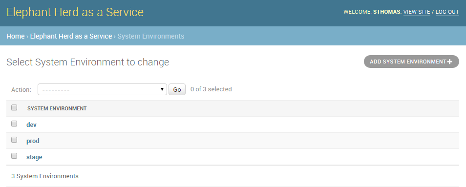
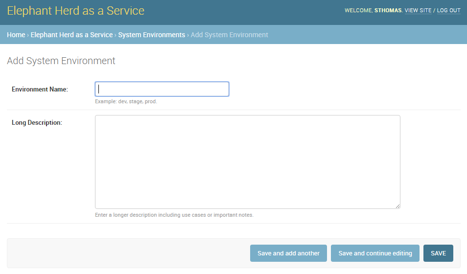
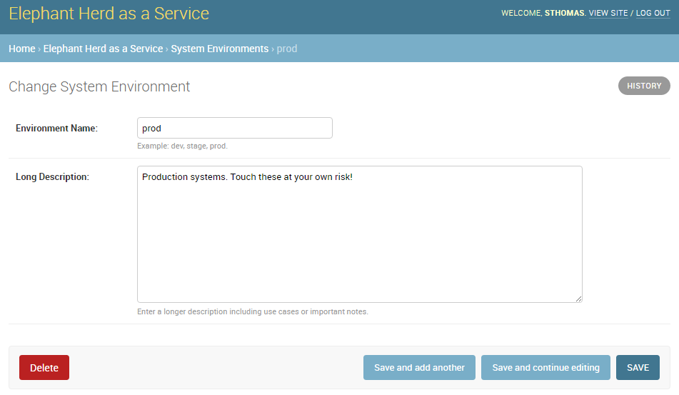
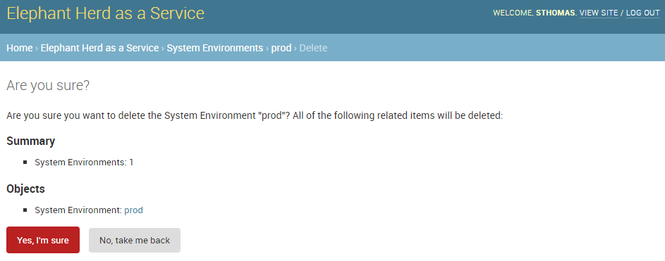
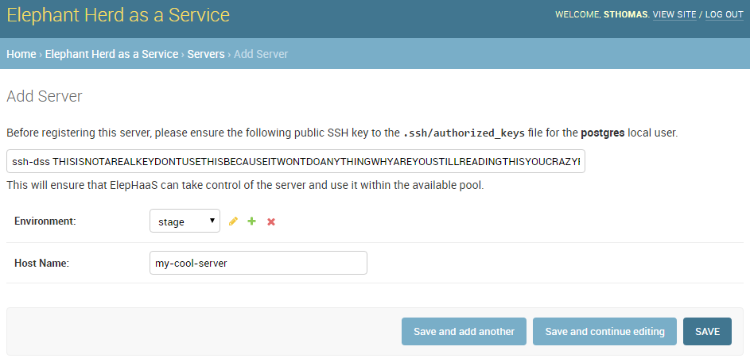

Elephant Herd as a Service
==========================

:Author: Shaun Thomas
:Date:  September 15th, 2016
:Venue: Postgres Open 2016

.. footer::

  Postgres Open 2016

  .. image:: images/logo.png
    :class: logo

.. header::

  .. oddeven::

    .. class:: right

      Page ###Page###

    .. class:: left

      Page ###Page###

Your Presenter
--------------

| Shaun M. Thomas
| Database Architect
| Peak6

I apologize in advance.

Who is This Guy?!
-----------------

You may remember me from:

* NVRam for Fun and Profit (PGOpen 2011)
* High Availability with PostgreSQL and Pacemaker (PGOpen 2012)
* Collectd and Graphite: Monitoring PostgreSQL with Style (PGOpen 2014)
* The Bones of Highly Available Postgres (PGOpen 2015)
* Postgres 9 High Availability Cookbook (Packt Publishing)
* PG Phriday (http://planet.postgresql.org)

.. container:: handout

  .. raw:: pdf

    Spacer 0,1em

  I practically live at this conference, and no, I have no idea why they keep subjecting everyone to my incoherent rambling.

ElepHaaS: Not What You Think
----------------------------

HaaS != Haas

Sorry to all the Haas groupies!

.. container:: handout

  .. raw:: pdf

    Spacer 0,1em

  While the esteemed Robert Haas has contributed a great deal to the Postgres project and community, ElepHaaS is not named after him. So sorry, Haas groupies! The real reason for the name is much more mundane.

The Problem
-----------

.. class:: incremental

  * We have 100+ Postgres instances
  * Consisting of 40 unique clusters
  * Spread over 4 operating environments
  * Located in 5 data centers
  * Representing 60+TB of data
  * Containing 1 partridge and 1 pear tree

.. container:: handout

  .. raw:: pdf

    Spacer 0,1em

  Our issue may not be a unique one, but it was certainly pressing. How to manage over 100 Postgres instances with some kind of semblance of organization. Configuration management tools only go so far, and logging into each server to perform operations doesn't scale. Performing DR tests was _especially_ pernicious. Failback was even worse.
  
  How do you even begin addressing that kind of problem?

The Solution
-------------

[ This space intentionally left blank ]

.. container:: handout

  .. raw:: pdf

    Spacer 0,1em

  There are no tools to manage such large heterogeneous clusters. The closest tool is probably repmgr, but event that operates on a per-cluster basis. What happens when you have dozens of clusters? We needed another layer of abstraction to address our use case, and there just isn't anything that fits the bill.

  So we decided to write one.

What is Postgres?
-----------------

Our grand mascot

.. container:: handout

  .. raw:: pdf

    Spacer 0,1em

  Backing up a bit, we need to name this thing somehow based on how it works. Let's start with the Postgres mascot itself, the grand elephant stomping other database engines into dust.

Add Replication
---------------

... and his family.

.. container:: handout

  .. raw:: pdf

    Spacer 0,1em

  Ever since Postgres acquired streaming replication, this organization became much more ubiquitous. It's now possible to have a herd of related Postgres instances. This is also where we begin to encounter potential management complications. Tools like `repmgr` simplify wrangling one herd no matter its size, and judicious scripting can probably juggle several.

  Unfortunately, we had crossed the "several" label years ago and were starting to feel the pain.

The Solution (Revisited)
------------------------

ElepHaaS is a service for managing *this*

.. container:: handout

  .. raw:: pdf

    Spacer 0,1em

  Instead of merely addressing a single herd, ElepHaaS can operate on multitudes. Larger organizations which rely on Postgres often have correspondingly wide architectures. At the very least, dozens of unrelated applications from competing or integrated teams tend to accumulate over the years.
  
  Regardless, all of these Postgres instances still require maintenance, management, backups, replica rebuilds, DR failovers, and any number of other tasks. Any one of these jobs would be onerous to perform on a mere 20 servers, let alone 200. Even with scripting, command broadcasting, and configuration management, there needs to be a central command nexus. So why not fully leverage it with a GUI wrapper?

What it Does
------------

.. class:: incremental

  * View and filter options to focus on specific herds
  * Start, stop, restart, or reload any managed instance
  * Promote, synchronize, and remaster replicas
  * Invoke Disaster Recovery failover---including DNS
  * Checkboxes to bulk-apply operations
  * Verify dangerous commands before activating

.. container:: handout

  .. raw:: pdf

    Spacer 0,1em

  From the second ElepHaaS was born, it was able to start, stop, and promote instances. That was the proof of concept that determined we should move forward with more features. From there, we started adding filters, search boxes where appropriate, and other niceties to encourage using the tool in place of ad-hoc management.
  
  Next came replica handling. Promoting a replica is really a different command sent to `pg_ctl`, so that was easy. Replica rebuilds required a bit more magic, and this is where the real power of ElepHaaS emerged. Already, we were able to apply bulk operations to entire constellations of instances and related replicas. Click a few checkboxes, select an operation, and boom!

  But merely rebuilding a replica isn't really enough. Disaster recovery pairs are a common fixture, so we wanted to directly support them. So we added a menu to explicitly acknowledge DR pairs. Any herd with more than one member is automatically listed, and a failover automatically chooses the most up-to-date replica. We even added DNS so applications could follow the migration.

  This is when ElepHaaS became a true "aaS" piece of software. The server containers where the instances run is not nearly as important as the data itself. Thus the first release was born.

Intrepid Ingredients
--------------------

.. class:: incremental

* Postgres
* Django
* SSH keys
* rsync

.. container:: handout

  .. raw:: pdf

    Spacer 0,1em

  There are surprisingly few moving parts, here. We obviously need Postgres. Beyond that, Django is notorious for its "free" admin interface for database models. That makes a perfect rapid application development choice for building a system specifically for administrating servers.
  
  But how to actually contact and manage those servers? What better than the network glue that is SSH keys? This enabler practically gives us carte-blanche to run arbitrary commands from a central location. Django can hide the gritty details and simply invoke the commands on our behalf on any instance we've registered, wherever it might reside.
  
  And rsync? It's still the best synchronization software available on UNIX systems. With our SSH keys in place, we can rebuild replicas with rsync. Future versions will probably integrate `pg_rewind` as a first pass to synchronize fewer files when applicable. Still, it's a much better choice than `pg_basebackup` for larger instances.

So, Why Django?
---------------

This is the environment model

.. code:: python

    class Environment(models.Model):
        environment_id = models.AutoField(primary_key=True)
        env_name = models.CharField('Environment Name',
            help_text='Example: dev, stage, prod.',
            max_length=40)
        env_descr = models.TextField('Long Description', max_length=2000)
        created_dt = models.DateField(editable=False)
        modified_dt = models.DateField(editable=False)

        class Meta:
            verbose_name = 'System Environment'
            db_table = 'ele_environment'
            ordering = ['env_name',]

        def __unicode__(self):
            return self.env_name

.. container:: handout

  .. raw:: pdf

    Spacer 0,1em

  For those who don't know what Django is, it's a Python site development toolkit. One central design motivation is to make sites that are data-driven, which implies a dependence on some kind of database. That data must be described by a model, and since this is Python, an ORM goes on top.
  
  That ORM is really what makes Django work. Table rows become Python objects, and the model itself is an abstraction for fetching various combinations of those objects. As a natural consequence, we gain a lot of related functionality.

Holy Crap!
----------

It looks like a lot, but gives us:

* A table definition for environments

  * With a non-default table name
  * And invisible auditing columns

* An object for manipulating environments

  * Which can fetch all existing environments
  * With default ordering
  * And a descriptive name
  * That can apply arbitrary filters

.. container:: handout

  .. raw:: pdf

    Spacer 0,1em

  A _lot_ of related functionality. We'll be using the base model object all over the scaffolding code. Beyond that convenience, we're allowed to override the default table and column names to better fit a traditional database architecture. It's hard for a DBA to resist that, right?
  
  The amount of code we wrote and the related ROI is why Django powers ElepHaaS.

Still, Why Django?
------------------

This creates an admin menu

.. code:: python

    class EnvironmentAdmin(admin.ModelAdmin):
        exclude = ('created_dt', 'modified_dt')

    admin.site.register(Environment, EnvironmentAdmin)

And that tiny bit of code gives us...

.. container:: handout

  .. raw:: pdf

    Spacer 0,1em

  And here is where Django really shines. The model code is much larger than the related admin code. Why? Some very patient human being wrote an entire harness of libraries that operates upon models, leveraging commonalities inherent to all models. This means that associating a model with said harness is the ultimate incantation.

  Let the menus begin!

Admin Menu: List
----------------

View existing environments

.. container:: handout

  .. raw:: pdf

    Spacer 0,1em

  Our model is admittedly simple, yet we're already seeing the benefits. The Django admin suite gives us a basic overview of table contents, complete with pagination, header sorting, and so on. And why not? It's all just SQL in the end, and we're more than familiar with that.

Admin Menu: Add
---------------

Add new environments

.. container:: handout

  .. raw:: pdf

    Spacer 0,1em

  Remember that help text we added to the model? Well, there it is! Beyond that, take a look at the menu bar itself and revel in the comprehensive breadcrumbs. They even facilitate data entry with multiple save options.

Admin Menu: Edit
----------------

Modify existing environments

.. container:: handout

  .. raw:: pdf

    Spacer 0,1em

  Editing uses the same format as adding, except we can delete from this menu as well. These forms are entirely based on the datatype we assigned to the model, so there's a certain consistency to the entire admin system.

Admin Menu: Delete
------------------

Verification before deleting

.. container:: handout

  .. raw:: pdf

    Spacer 0,1em

  And by default, all deletions trigger a confirmation step that presents us with the consequences of proceeding. Possibly the best part about all of these menus is that they're template-driven, meaning we can override any of them. Maybe we want more detailed confirmation pages, for example.

Pesky Prerequisites
-------------------

* Django: duh
* Psycopg2: communicate with Postgres
* Paramiko: Python SSH commands
* DNSPython: For DNS migrations
* django-auth-ldap: For (optional) LDAP auth.

.. container:: handout

  .. raw:: pdf

    Spacer 0,1em

  ElepHaaS _does_ require a few Python libraries beyond any Django might demand. All of them map directly to functionality ElepHaaS offers. We need Psycopg to connect to Postgres, Paramiko to invoke remote SSH commands, and DNSPython for DNS migrations in DR failovers.

  In addition, we've split the configuration files and included examples for incorporating LDAP authentication. This means anyone with managed user accounts can integrate ElepHaaS directly into their organization. As long as the necessary Python library is there, of course.

  Take _that_, subspace.

Basic Installation
------------------

Start with requirements

.. code:: bash

  pip install django psycopg2 paramiko dnspython

Install the engine

.. code:: bash

  wget https://github.com/peak6/elephaas/archive/v1.0.0.tar.gz
  tar -xzf elephaas-1.0.0.tar.gz

Use or modify default config

.. code:: bash

  cd elephaas-1.0.0
  mv elephaas/local_settings.example.py elephaas/local_settings.py

.. container:: handout

  .. raw:: pdf

    Spacer 0,1em

  There's no make file or `configure` script, but we did include packaging for Debian-derived systems, with RHEL on the horizon. Without that, installation is hardly arduous. Really it just boils down to unpacking the archive and creating one config file.

Get it Running
--------------

Initialize the metadata

.. code:: bash

  createdb admin
  psql admin -c 'CREATE SCHEMA utility;'

  python manage.py migrate
  python manage.py createsuperuser

Start the service

.. code:: bash

  python manage.py runserver 0.0.0.0:8000

.. container:: handout

  .. raw:: pdf

    Spacer 0,1em

  The commands here assume the default configuration file was used without modification. This means ElepHaaS will store its metadata in a database named `admin` in the `utility` schema. Beyond that, Django uses `manage.py` as a master command interface to Django projects. The `migrate` parameter to `manage.py` bootstraps all necessary metadata, and `createsuperuser` allows us to log in. If we're not using LDAP, we can add more users from the admin interface itself.

  Then we just start the daemon itself. In a real system, we probably wouldn't use the `runserver` parameter of `manage.py`, as that's generally reserved for debugging. But it's perfect for testing things out! There are lots of other more formal ways to run a Django app.

Link Servers
------------

Set up SSH keys on all managed systems

.. code:: bash

  ssh-keygen -t dsa -N '' -f ~/.ssh/id_dsa
  ssh-copy-id postgres@my-cool-server
  ssh-copy-id postgres@my-lame-server
  ssh-copy-id postgres@my-insane-server

But remember:

* Make sure it's the user running ElepHaaS
* Use Chef, Puppet, Salt, etc., for best results

.. container:: handout

  .. raw:: pdf

    Spacer 0,1em

  Whatever user is running the actual ElepHaaS daemon needs their SSH key on all systems we want to manage. In an ideal world, we'd do that by generating the key and using some kind of configuration management tool to broadcast that key to all of the appropriate server and container profiles. But it's not too difficult to perform this task manually either, and we only need to do it once.

  This is the glue that binds ElepHaaS to all of instances it manages.

Add New Servers
---------------

ElepHaaS reminds you of SSH keys

.. container:: handout

  .. raw:: pdf

    Spacer 0,1em

  One of the configuration settings in `local_settings.py` is our public SSH key. When adding a server, ElepHaaS presents this key _just in case_ the new server doesn't have it already. We wanted to make sure it was obvious this is how ElepHaaS communicates with instances on all servers.

Short Demo
----------

Let's see it in action!

That's All it Does?!
--------------------

B-but...

.. container:: handout

  .. raw:: pdf

    Spacer 0,1em

  Sadly, yes. ElepHaaS is still relatively young, and thus far, has a grand total of one active developer who still has a day job. Granted, that job is simplified to a certain extent by ElepHaaS itself, but there are still development velocity limitations.
  
  What ElepHaaS currently does is not _nearly_ enough, but it's a great start. Everything is on github, and we welcome sane pull requests.

Future Plans
------------

* More bulk commands
* Additional sidebar filters
* Initialize new instances
* Backup management (pgBackRest!)
* Add menu ACLs
* Plugins?
* See the TODO

.. container:: handout

  .. raw:: pdf

    Spacer 0,1em

  This list really could be endless. We have the basic scaffolding for a potentially amazing tool, and it's already at a point where it vastly simplifies constellation management. Of course, there's always room for improvement. Our choice of Python and Django mean functionality should be relatively easy to add, too.

  Well, eventually.

See Also
--------

`ele_tools`

* Companion python tools for managed hosts
* Currently only `ele_report`

  * Does status reports to ElepHaaS
  * Autodiscovery of new instances

* Depends on `pg_lsclusters` Debian tools

.. container:: handout

  .. raw:: pdf

    Spacer 0,1em

  Since ElepHaaS originated on an Ubuntu system, it uses a lot of the Debianisms that environment provides. The `pgutil_report` tool performs Postgres instance auto-discovery and transmits everything it finds by injecting it directly into ElepHaaS database metadata. As a result, the `pg_lsclusters` utility was the easiest way to "find" Postgres instances on a server.
  
  This tool works best when combined (notice a trend?) with configuration management. Install it on any server with a Postgres profile, and all instances will automatically populate in ElepHaaS. It's definitely easier to manage instances when they tattle on themselves.

  But sadly, this tool only works on Debian-based Linux distributions due to its reliance on `pg_lsclusters`. More comprehensive detection mechanisms could generalize it so RHEL (or other Linux friends) can also enable autodiscovery. Still, it's just a convenience that doesn't affect ElepHaaS itself, so feel free to ignore it!

More Information
----------------

* `The Django project <https://www.djangoproject.com/>`_
* `ElepHaaS on github <https://github.com/peak6/elephaas/>`_
* `ele_tools on github <https://github.com/peak6/ele_tools/>`_
* `pgBackRest <http://www.pgbackrest.org/>`_

Questions
---------

